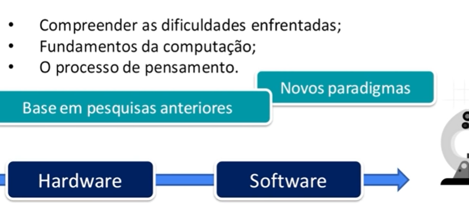

# Introdução á Linguagens de Programação

***

## <mark style="color:red;">História da computação</mark>

<figure><figcaption></figcaption></figure>

<figure><figcaption></figcaption></figure>

Os computadores modernos têm suas raízes em máquinas mais simples desenvolvidas no século XIX, como a máquina analítica de Charles Babbage. No entanto, o primeiro computador programável eletrônico foi o Colossus, desenvolvido durante a Segunda Guerra Mundial para ajudar a decifrar códigos nazistas. Logo após a guerra, surgiram outros projetos importantes, como o ENIAC nos Estados Unidos e o Manchester Baby no Reino Unido.

<figure><figcaption></figcaption></figure>

<figure><figcaption></figcaption></figure>

<figure><figcaption></figcaption></figure>

<figure><figcaption></figcaption></figure>

<figure><figcaption></figcaption></figure>

<figure><figcaption></figcaption></figure>

***

## <mark style="color:red;">Linguagens de Computadores</mark>

Com o surgimento dos primeiros computadores, tornou-se necessário encontrar maneiras de se comunicar com eles de forma mais eficiente do que simplesmente mudar fisicamente as ligações ou interruptores. Isso levou ao desenvolvimento das primeiras linguagens de programação.

<figure><figcaption></figcaption></figure>

***

### <mark style="color:red;">Assembly Language</mark>

<figure><figcaption></figcaption></figure>

A linguagem de programação assembly é uma linguagem de baixo nível que utiliza instruções simbólicas e códigos mnemônicos para representar as operações do processador. Cada instrução assembly é traduzida diretamente em uma instrução de linguagem de máquina específica para o processador em questão. Embora poderosa, a programação em assembly é complexa e específica para cada tipo de processador.

***

### <mark style="color:red;">Fortran</mark>

Uma das primeiras linguagens de alto nível foi o Fortran (Formula Translation), desenvolvido na década de 1950 pela IBM. Foi projetado para cálculos científicos e engenharia, tornando-se uma das linguagens mais influentes da época.

***

### <mark style="color:red;">Cobol</mark>

Desenvolvida na mesma época que o Fortran, a linguagem COBOL (Common Business-Oriented Language) foi projetada para aplicações comerciais e financeiras. Foi uma das primeiras linguagens de programação amplamente utilizadas para processamento de dados empresariais.

***

### <mark style="color:red;">Lisp</mark>

Lisp (List Processing) foi uma das primeiras linguagens de programação de alto nível e é conhecida por seu foco em processamento simbólico e listas como estrutura de dados fundamental. Desenvolvida na década de 1950 por John McCarthy, Lisp influenciou muitas outras linguagens, especialmente em inteligência artificial e processamento de linguagem natural.

***

### <mark style="color:red;">Algol</mark>

ALGOL (ALGOrithmic Language) foi uma família de linguagens de programação desenvolvidas principalmente na década de 1960. Embora não tenha sido amplamente adotada, influenciou o design de muitas outras linguagens, incluindo Pascal, C e Ada.

***

### <mark style="color:red;">C</mark>

Desenvolvida no início da década de 1970 por Dennis Ritchie na Bell Labs, a linguagem C foi projetada originalmente para implementar o sistema operacional Unix. C é uma linguagem de programação de propósito geral que influenciou significativamente o design de muitas outras linguagens modernas, incluindo C++, Java e Python.

***

<figure><figcaption></figcaption></figure>

<figure><figcaption></figcaption></figure>

***
